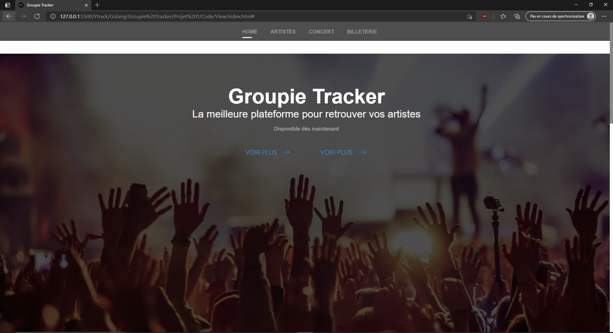

# Groupie Tracker Project

## Presentation

Groupie tracker are an interact website which you can find everything about the music in general.

## Getting Started

You have, in the root project :

- launch the terminal and type `go run ./main.go`
- After, you can access in the website with this local adress : [http://localhost:8080](http://localhost:8080)

You will be redirected in the Home Page. For more informations about this, you can check the **Pages.go** programm. You can see a part of the Home Page here

## A big API to find all the users

The Groupie tracker API have no more of 50 Artists with a lot of details about them. You can check the Nationnality, the Dates and Locations of their concerts, and a lot of others informations. You can also reserve you ticket for the next concerts of you favorites Artist !
